  

  
  
  
  
  

# Hey, I'm Emre

I build small, practical tools around **web security**, **automation** and **AI workflows**.

Most of my work sits somewhere between:

- 🛡️ web application security
- 🧭 recon and bug bounty workflow automation
- 🔐 authentication, SSRF and API testing
- 🔌 MCP / n8n / local AI automation experiments
- 📱 product and mobile prototypes when I want to test an idea quickly

I like tools that remove repetitive work, make messy workflows easier to run, and help me understand systems more deeply.

---

## 🎯 What I'm focused on

- 🧪 cleaning up my security automation experiments
- ⚙️ building better recon and request workflow tools
- 📝 writing practical notes around auth, SSRF, access control and API security
- 🔗 connecting AI tools with real automation workflows
- 📦 turning rough prototypes into readable public projects

---

## 🛡️ Security practice

- 🧬 **PortSwigger Web Security Academy** — 40+ labs completed
- ⚔️ **HackTheBox** — active practice
- 🔎 **Focus areas:** authentication, SSRF, access control, API security, recon workflows

---

## 🧰 Tools I reach for

**Security:** Burp Suite, Nmap, Nuclei, ffuf, SQLMap, Subfinder  
**Languages:** Python, JavaScript, TypeScript, Bash  
**Automation:** n8n, MCP, GitHub Actions  
**Product:** React, React Native, Expo, Vite

  

---

## 🧱 Things I'm building / cleaning up

- 🐍 `network_automation_sender` — async Python experiments for request automation and monitoring
- 🛰️ `aspergillus-pro.io` — network monitoring / traffic visibility dashboard
- 🔌 `mcp-gemini` — MCP/SSE experiment for connecting AI workflows with n8n automation
- 🌌 `stardust-ios` — mobile prototype exploring AI-guided daily rituals and subscription UX

Some repos are still rough. I'm slowly turning experiments into cleaner, documented projects.
